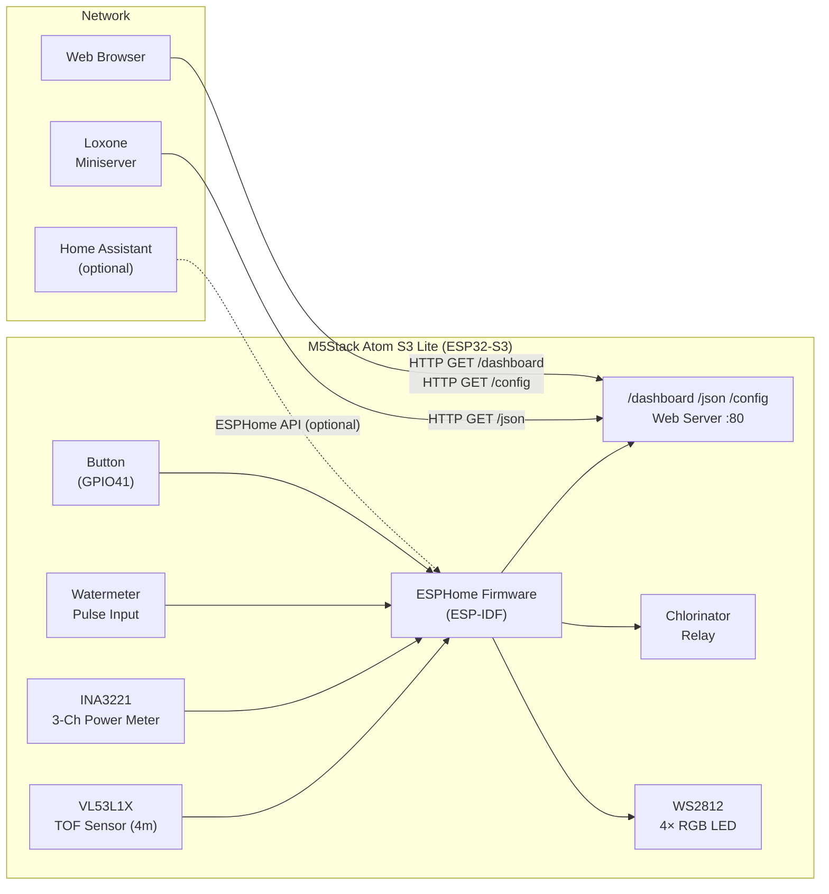
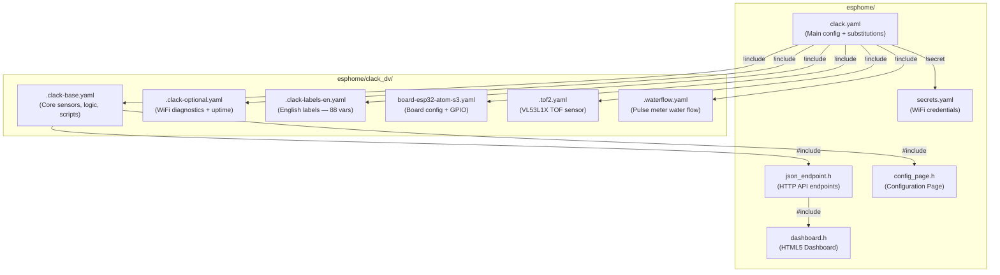
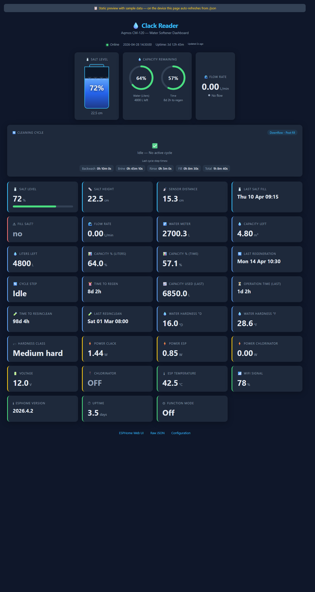
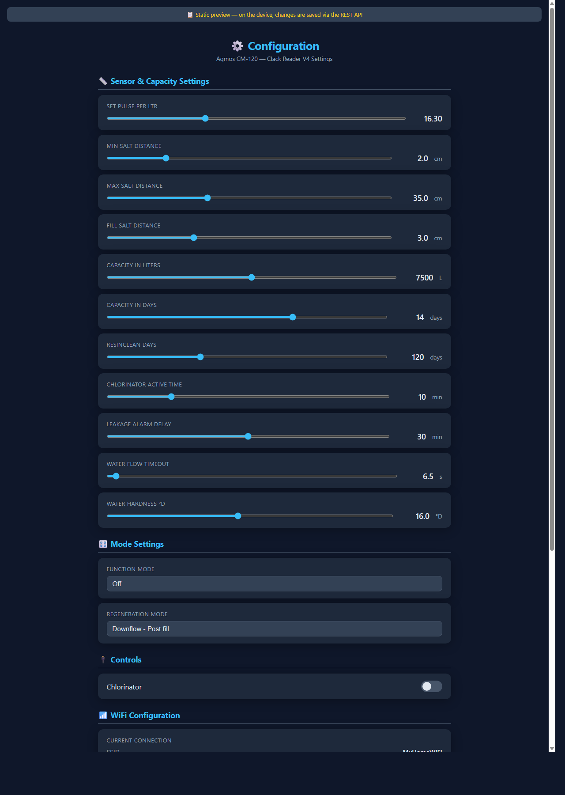
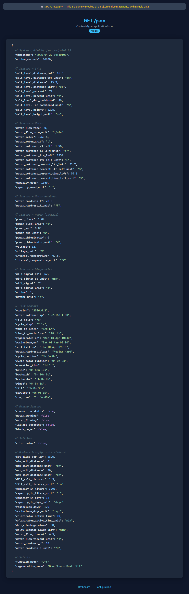
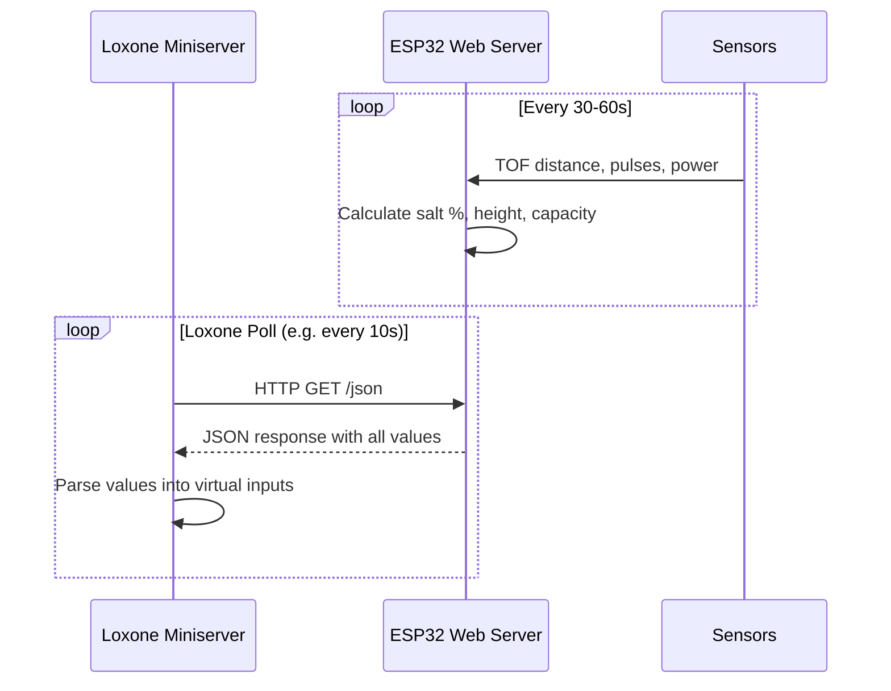
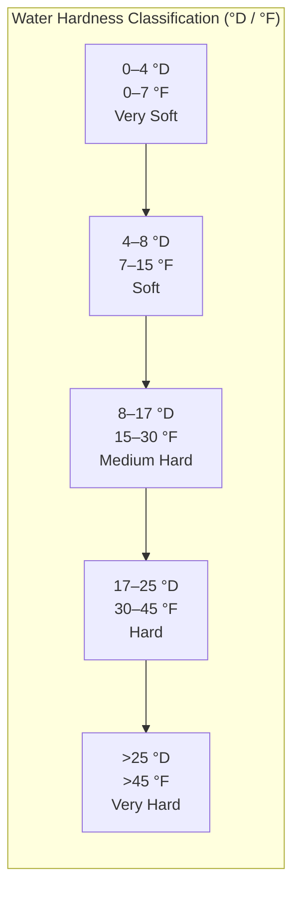

# 💧 Clack Reader V4 — Loxone Edition

ESPHome firmware for the **Aqmos CM-120 water softener** (Clack WS1 CI valve) with TOF salt level sensor, water meter pulse counting, chlorinator relay control, and 3-channel power monitoring. This fork adds a **JSON API**, **HTML5 dashboard**, and **web configuration page** for integration with **Loxone Miniserver** (or any HTTP-polling system), replacing the need for Home Assistant.

> Based on [fonske/clack-reader-v4](https://github.com/fonske/clack-reader-v4) — adapted for standalone Loxone use with Aqmos CM-120.

---

## 📐 System Architecture



---

## ✨ Features

| Feature | Description |
|---------|-------------|
| **JSON API** (`/json`) | All sensor values as a flat JSON object — perfect for Loxone Virtual HTTP Inputs |
| **HTML5 Dashboard** (`/dashboard`) | Dark-themed live dashboard with salt tank, capacity gauges, top Water Meter / Flow Rate / Leak Detection cards, and a cleaning-cycle stepper |
| **Configuration Page** (`/config`) | Web UI for all settings, WiFi management, and device restart |
| **Salt Level Monitoring** | VL53L1X TOF sensor (up to 4m range) measures distance → calculates salt height & percentage |
| **Water Meter** | Pulse counting at 16.30 pulses/liter for Clack WS1 CI flowmeter (Aqmos CM-120) |
| **Capacity Tracking** | Liters, m³, percentage, and days remaining until next regeneration |
| **Regeneration Cycle Tracking** | Detects and times each cycle phase (backwash, brine, rinse, fill, service) and records water used during the cycle |
| **Chlorinator Control** | GPIO relay with configurable timed auto-off delay (0–45 min) |
| **3-Channel Power Monitoring** | INA3221 measures power for Clack PCB, ESP, and Chlorinator independently |
| **Water Hardness** | Configurable slider in °D with auto-calculated °F and classification |
| **Leakage Detection** | Alerts when continuous water flow exceeds the configurable delay, with a top dashboard status card and red alert banner |
| **Resin Cleaning Tracker** | Tracks days since last resin clean with configurable interval |
| **WiFi Watchdog** | Auto-reboots if WiFi disconnects for >5 minutes |
| **WiFi Management** | Change SSID/password or reset to defaults via `/config` page |
| **Multi-language** | English labels included (88 substitution variables) |
| **OTA Updates** | Over-the-air firmware updates via ESPHome |
| **API Token Authentication** | Optional Bearer token protects all `/api/*` endpoints (set in `secrets.yaml`) |
| **I2C Diagnostics** | `/api/diag` endpoint with I2C bus scan, sensor states, and free heap |
| **Physical Button** | Toggle status LED on/off (short press) or adjust brightness (long press) |

---

## 📁 File Structure



```
esphome/
├── clack.yaml                          # Main config — edit this file
├── secrets.yaml                        # WiFi SSID/password + optional static IP
├── json_endpoint.h                     # C++ — /json, /dashboard, /config, /api/* endpoints
├── dashboard.h                         # C++ — HTML5 dashboard (top metrics, cycle stepper, sensor cards)
├── config_page.h                       # C++ — Configuration page with WiFi management
└── clack_dv/
    ├── .clack-base.yaml                # Core: globals, scripts, sensors, sliders, cycle tracking
    ├── .clack-labels-en.yaml           # English entity names (88 substitutions)
    ├── .clack-optional.yaml            # WiFi signal strength, uptime sensors
    ├── .tof2.yaml                      # VL53L1X TOF sensor (external component)
    ├── .waterflow.yaml                 # Pulse meter water flow (GPIO7, 16.30 pulses/L)
    └── board-esp32-atom-s3.yaml        # M5Stack Atom S3 Lite board, pins, LED, buttons
```

---

## 🚀 Quick Start

### 1. Prerequisites

- [ESPHome](https://esphome.io/guides/installing_esphome.html) installed (CLI or Home Assistant add-on)
- **M5Stack Atom S3 Lite** (ESP32-S3, 8MB flash) with the Clack Reader V4 PCB
- **VL53L1X** TOF sensor (M5Stack ToF4M, SKU: U172) connected via I2C Grove cable (max 2m)
- **INA3221** 3-channel power monitor at I2C address 0x41

### 2. Configure WiFi

Edit `esphome/secrets.yaml`:

```yaml
wifi_ssid: "YourWiFiSSID"
wifi_password: "YourWiFiPassword"
```

### 2b. (Optional) Configure API Token

To protect `/api/*` endpoints with token authentication, set `api_token` in `secrets.yaml`:

```yaml
api_token: "my-secret-token-here"
```

When set, all `/api/*` endpoints require authentication via query parameter or header (see [API Authentication](#-api-authentication)). Leave empty (`""`) to disable authentication.

### 3. (Optional) Configure Static IP

For reliable Loxone polling, uncomment in `secrets.yaml`:

```yaml
static_ip: "192.168.1.50"
gateway: "192.168.1.1"
subnet: "255.255.255.0"
dns1: "192.168.1.1"
```

Then uncomment the `manual_ip:` block in `clack.yaml`:

```yaml
  manual_ip:
    static_ip: !secret static_ip
    gateway: !secret gateway
    subnet: !secret subnet
    dns1: !secret dns1
```

### 4. Compile & Flash

```bash
cd esphome
esphome compile clack.yaml
esphome upload clack.yaml
```

Or with Python module syntax (if `esphome` CLI is not on PATH):

```bash
python -m esphome compile esphome/clack.yaml
python -m esphome upload esphome/clack.yaml --device <IP_or_COM_port>
```

### 5. Access the Device

| URL | Description |
|-----|-------------|
| `http://<device-ip>/` | Redirects to `/dashboard` |
| `http://<device-ip>/json` | JSON API — all sensor values as flat JSON |
| `http://<device-ip>/dashboard` | HTML5 dashboard — top metrics, cycle tracking, and visual monitoring cards |
| `http://<device-ip>/config` | Configuration page — settings, WiFi management, restart |

### 🖼️ Page Previews

Below are screenshots of each page with dummy sample data. You can also open the static HTML mockups in [`images/`](images/) to explore the GitHub preview pages in your browser.

#### `/dashboard` — Sensor Dashboard

Top metric cards for Water Meter, Flow Rate, and Leak Detection, plus color-coded cards showing salt, water, power, and system status at a glance.



#### `/config` — Configuration Page

Sliders, dropdowns, toggle switches, WiFi management, and system controls.



#### `/json` — JSON API Response

Flat JSON with all sensor values, binary states, configurable numbers, and selects.



---

## 🌐 JSON API Reference

### Endpoints

| Endpoint | Method | Content-Type | Auth | Description |
|----------|--------|--------------|------|-------------|
| `/json` | GET | `application/json` | No | All entity states as flat JSON with units |
| `/dashboard` | GET | `text/html` | No | HTML5 dashboard page |
| `/config` | GET | `text/html` | No | Configuration page |
| `/api/entities` | GET | `application/json` | Yes | Metadata for numbers, selects, switches |
| `/api/set` | POST | `text/plain` | Yes | Set entity values (domain, id, value params) |
| `/api/wifi` | GET | `application/json` | Yes | Current WiFi info (SSID, IP, gateway, DNS, RSSI, MAC) |
| `/api/wifi` | POST | `text/plain` | Yes | Change WiFi credentials (`ssid` + `password`) or reset (`reset=1`) |
| `/api/restart` | POST | `text/plain` | Yes | Restart the device |
| `/api/diag` | GET | `application/json` | Yes | I2C bus scan, sensor diagnostics, free heap |

> **Auth column:** When `api_token` is set in `secrets.yaml`, endpoints marked "Yes" require authentication. Endpoints marked "No" are always open. See [API Authentication](#-api-authentication) below.

### 🔐 API Authentication

When `api_token` is set to a non-empty value in `secrets.yaml`, all `/api/*` endpoints require a valid token. The `/json`, `/dashboard`, and `/config` endpoints remain open (no authentication required).

The `/config` page can pass the token to its API calls when opened as `http://<device-ip>/config?token=YOUR_TOKEN`. If a protected API call returns `401`, the page prompts for the token and stores it in the browser for later visits.

**Two ways to authenticate:**

1. **Query parameter:** append `?token=YOUR_TOKEN` to the URL
   ```
   GET http://<device-ip>/api/entities?token=my-secret-token
   POST http://<device-ip>/api/set?token=my-secret-token&domain=number&id=water_hardness_d&value=18
   ```

2. **Authorization header:** send a `Bearer` token header
   ```
   GET http://<device-ip>/api/entities
   Authorization: Bearer my-secret-token
   ```

**Unauthorized requests** receive a `401 Unauthorized` response:
```
HTTP/1.1 401
Unauthorized: invalid or missing token
```

**To disable authentication:** leave `api_token` empty in `secrets.yaml`:
```yaml
api_token: ""
```

### Example `/json` Response

> The `/json` endpoint outputs **all** non-internal entities (sensors, text sensors, binary sensors, switches, numbers, selects). Sensors and numbers with a `unit_of_measurement` also get a `_unit` suffix key. The example below shows all fields produced by a typical running system.

```json
{
  "timestamp": "2026-04-27T14:30:00",
  "uptime_seconds": 86400,

  "salt_level_distance_tof": 15.3,
  "salt_level_distance_tof_unit": "cm",
  "salt_level_distance": 15.3,
  "salt_level_distance_unit": "cm",
  "salt_level_percent": 72,
  "salt_level_percent_unit": "%",
  "salt_level_for_dashboard": 80,
  "salt_level_for_dashboard_unit": "%",
  "salt_level_height": 22.5,
  "salt_level_height_unit": "cm",

  "water_flow_rate": 0.0,
  "water_flow_rate_unit": "L/min",
  "water_meter": 1250.5,
  "water_meter_unit": "L",
  "water_softener_m3_left": 1.95,
  "water_softener_m3_left_unit": "m³",
  "water_softener_ltr_left": 1950,
  "water_softener_ltr_left_unit": "L",
  "water_softener_percent_ltr_left": 52.7,
  "water_softener_percent_ltr_left_unit": "%",
  "water_softener_percent_time_left": 57.1,
  "water_softener_percent_time_left_unit": "%",
  "capacity_used": 1150.0,
  "capacity_used_unit": "L",
    "cycle_water_used": 128.6,
    "cycle_water_used_unit": "L",

  "water_hardness_d": 16,
  "water_hardness_d_unit": "°D",
  "water_hardness_f": 28.6,
  "water_hardness_f_unit": "°F",
  "water_hardness_class": "Medium hard",

  "power_clack": 1.44,
  "power_clack_unit": "W",
  "power_esp": 0.85,
  "power_esp_unit": "W",
  "power_chlorinator": 0.0,
  "power_chlorinator_unit": "W",
  "voltage": 12.0,
  "voltage_unit": "V",
  "internal_temperature": 42.5,
  "internal_temperature_unit": "°C",

  "wifi_signal_db": -62,
  "wifi_signal_db_unit": "dBm",
  "wifi_signal": 78,
  "wifi_signal_unit": "%",
  "version": "2026.4.2",
  "uptime": 1.0,
  "uptime_unit": "d",
  "water_softener_ip": "192.168.1.50",

  "regenerated_on": "Mon 14 Apr 10:30",
  "resinclean_on": "Sat 01 Mar 08:00",
  "salt_fill_on": "Thu 10 Apr 09:15",
  "cycle_step": "Idle",
  "time_to_regen": "12d 6h",
  "time_to_resinclean": "98d 4h",
  "cycle_runtime": "0h 0m 0s",
  "cycle_total_runtime": "0h 0m 0s",
  "operation_time": "1d 2h",
  "brine": "0h 45m 10s",
  "backwash": "0h 10m 0s",
  "backwash2": "0h 0m 0s",
  "rinse": "0h 5m 0s",
  "fill": "0h 8m 30s",
  "service": "0h 0m 0s",
  "run_time": "1h 8m 40s",
  "fill_salt": "no",

  "connection_status": true,
  "motor_running": false,
  "water_flowing": false,
  "leakage_detected": false,
  "block_regen": false,

  "chlorinator": false,

  "set_pulse_per_ltr": 16.30,
  "min_salt_distance": 0,
  "min_salt_distance_unit": "cm",
  "max_salt_distance": 30,
  "max_salt_distance_unit": "cm",
  "fill_salt_distance": 1.5,
  "fill_salt_distance_unit": "cm",
  "capacity_in_liters": 7500,
  "capacity_in_liters_unit": "L",
  "capacity_in_days": 14,
  "capacity_in_days_unit": "days",
  "resinclean_days": 120,
  "resinclean_days_unit": "days",
  "chlorinator_active_time": 10,
  "chlorinator_active_time_unit": "min",
  "delay_leakage_alarm": 30,
  "delay_leakage_alarm_unit": "min",
  "water_flow_timeout": 6.5,
  "water_flow_timeout_unit": "s",

  "function_mode": "Off",
  "regeneration_mode": "Downflow - Post fill"
}
```

### Key JSON Fields

#### System (added by json_endpoint.h)

| Key | Type | Unit | Description |
|-----|------|------|-------------|
| `timestamp` | string | ISO 8601 | Current time from NTP |
| `uptime_seconds` | number | s | Seconds since boot (millis-based) |

#### Salt Level Sensors

| Key | Type | Unit | Description |
|-----|------|------|-------------|
| `salt_level_distance_tof` | number | cm | VL53L1X raw TOF sensor distance |
| `salt_level_distance` | number | cm | Last stored TOF distance value |
| `salt_level_percent` | number | % | Salt level percentage (0–100) |
| `salt_level_for_dashboard` | number | % | Stepped salt level for dashboard animation (0/10/20/40/60/80/100) |
| `salt_level_height` | number | cm | Calculated salt height from bottom |

#### Water Sensors

| Key | Type | Unit | Description |
|-----|------|------|-------------|
| `water_flow_rate` | number | L/min | Current water flow rate from pulse meter |
| `water_meter` | number | L | Total water used since last regeneration |
| `water_softener_m3_left` | number | m³ | Capacity remaining in cubic meters |
| `water_softener_ltr_left` | number | L | Capacity remaining in liters |
| `water_softener_percent_ltr_left` | number | % | Capacity remaining as percentage of liters |
| `water_softener_percent_time_left` | number | % | Capacity remaining as percentage of time |
| `capacity_used` | number | L | Total liters used during last regeneration cycle |
| `cycle_water_used` | number | L | Water used by the current or last cleaning/regeneration cycle |
| `water_hardness_f` | number | °F | Water hardness (French degrees, auto-calculated) |

#### Power Sensors

| Key | Type | Unit | Description |
|-----|------|------|-------------|
| `power_clack` | number | W | Clack PCB power (INA3221 ch1) |
| `power_esp` | number | W | ESP/Atom S3 power (INA3221 ch2) |
| `power_chlorinator` | number | W | Chlorinator power (INA3221 ch3) |
| `voltage` | number | V | Bus voltage (INA3221 ch1) |
| `internal_temperature` | number | °C | ESP32-S3 internal die temperature |

#### Diagnostics & System Sensors

| Key | Type | Unit | Description |
|-----|------|------|-------------|
| `wifi_signal_db` | number | dBm | WiFi signal strength in dBm |
| `wifi_signal` | number | % | WiFi signal strength in percent |
| `uptime` | number | d | Device uptime in days |

#### Text Sensors

| Key | Type | Description |
|-----|------|-------------|
| `version` | string | ESPHome firmware version |
| `water_softener_ip` | string | Device IP address |
| `fill_salt` | string | "yes" or "no" — salt refill needed? |
| `cycle_step` | string | Current regeneration phase (Idle/Backwash/Brine/Backwash2/Rinse/Fill/Service) |
| `time_to_regen` | string | Time remaining until next regeneration (e.g. "12d 6h") |
| `time_to_resinclean` | string | Time remaining until next resin clean (e.g. "98d 4h") |
| `regenerated_on` | string | Date/time of last regeneration (e.g. "Mon 14 Apr 10:30") |
| `resinclean_on` | string | Date/time of last resin clean |
| `salt_fill_on` | string | Date/time of last salt fill |
| `water_hardness_class` | string | Very soft / Soft / Medium hard / Hard / Very hard |
| `operation_time` | string | Total operation time of last regeneration cycle |
| `cycle_runtime` | string | Current cycle step elapsed time (h/m/s) |
| `cycle_total_runtime` | string | Total regeneration elapsed time (h/m/s) |
| `brine` | string | Last brine step duration |
| `backwash` | string | Last backwash step duration |
| `backwash2` | string | Last backwash2 step duration |
| `rinse` | string | Last rinse step duration |
| `fill` | string | Last fill step duration |
| `service` | string | Last service step duration |
| `run_time` | string | Last total regeneration run time |

#### Binary Sensors

| Key | Type | Description |
|-----|------|-------------|
| `connection_status` | boolean | ESP online/offline status |
| `motor_running` | boolean | Clack motor currently running |
| `water_flowing` | boolean | Water flow detected (pulse meter active) |
| `leakage_detected` | boolean | Continuous water flow alarm triggered |
| `block_regen` | boolean | Regeneration cycle currently blocked |

#### Switches

| Key | Type | Description |
|-----|------|-------------|
| `chlorinator` | boolean | Chlorinator relay on/off state |

#### Configurable Numbers (sliders/inputs)

| Key | Type | Unit | Description |
|-----|------|------|-------------|
| `water_hardness_d` | number | °D | Water hardness setting (German degrees) |
| `set_pulse_per_ltr` | number | — | Pulses per liter (16.30 for Clack WS1, 28.60 for DV) |
| `min_salt_distance` | number | cm | Sensor distance when salt tank is full |
| `max_salt_distance` | number | cm | Sensor distance when salt tank is empty |
| `fill_salt_distance` | number | cm | Salt height below which "fill salt = yes" |
| `capacity_in_liters` | number | L | Water softener capacity per regeneration cycle (7500 L for CM-120 at 16°dH) |
| `capacity_in_days` | number | days | Expected days between regenerations |
| `resinclean_days` | number | days | Interval between resin cleaning |
| `chlorinator_active_time` | number | min | Chlorinator auto-off timer |
| `delay_leakage_alarm` | number | min | Continuous flow time before leakage alarm |
| `water_flow_timeout` | number | s | Flow sensor pulse timeout |

#### Selects

| Key | Type | Description |
|-----|------|-------------|
| `function_mode` | string | Off / Chlorinator |
| `regeneration_mode` | string | Upflow - Post fill / Upflow - Pre fill / Downflow - Post fill / Downflow - Pre fill |

---

## 🏠 Loxone Integration

### Polling Flow



### Setup in Loxone Config

1. **Add a Virtual HTTP Input** in Loxone Config
2. Set the URL to: `http://<clack-ip>/json`
   - The `/json` endpoint does **not** require authentication, even when `api_token` is set
   - If you need to call `/api/*` endpoints from Loxone, append `?token=YOUR_TOKEN` to the URL
3. Set the polling interval (e.g. `10` seconds)
4. **Add Virtual HTTP Input Commands** for each value you want to use:

| Loxone Command Name | JSON Path | Example |
|---|---|---|
| Salt Level | `\v"salt_level_percent":\v` | `72` |
| Salt Height | `\v"salt_level_height":\v` | `22.5` |
| Water Meter | `\v"water_meter":\v` | `1250.5` |
| Flow Rate | `\v"water_flow_rate":\v` | `0.0` |
| Cycle Water Used | `\v"cycle_water_used":\v` | `128.6` |
| Liters Left | `\v"water_softener_ltr_left":\v` | `1950` |
| m³ Left | `\v"water_softener_m3_left":\v` | `1.95` |
| % Liters Left | `\v"water_softener_percent_ltr_left":\v` | `52.7` |
| % Time Left | `\v"water_softener_percent_time_left":\v` | `57.1` |
| Fill Salt | `\v"fill_salt":"\v` | `no` |
| Cycle Step | `\v"cycle_step":"\v` | `Idle` |
| Time to Regen | `\v"time_to_regen":"\v` | `12d 6h` |
| Time to Resinclean | `\v"time_to_resinclean":"\v` | `98d 4h` |
| Power Clack | `\v"power_clack":\v` | `1.44` |
| Power ESP | `\v"power_esp":\v` | `0.85` |
| Power Chlorinator | `\v"power_chlorinator":\v` | `0.0` |
| Voltage | `\v"voltage":\v` | `12.0` |
| WiFi Signal | `\v"wifi_signal":\v` | `78` |
| Motor Running | `\v"motor_running":\v` | `false` |
| Water Flowing | `\v"water_flowing":\v` | `false` |
| Leakage | `\v"leakage_detected":\v` | `false` |
| Chlorinator | `\v"chlorinator":\v` | `false` |

> **Tip:** For Loxone parsing, use `\v` as value delimiter. The pattern `\v"key":\v` extracts the value after the colon.

---

## 📊 HTML5 Dashboard

Access at `http://<device-ip>/dashboard`


The dashboard features:
- **Dark theme** with card-based layout
- **Top metric cards** for Water Meter, Flow Rate, and Leak Detection
- **Cleaning-cycle view** with large 120 px step icons, arrows between steps, elapsed time, cycle type, total time, and cycle water usage
- **Sensor cards** organized by category with color-coded borders:
  - 🔵 **Salt** (cyan) — level %, height, distance, fill alert
  - 🔵 **Water** (blue) — meter, capacity (m³ + L), regeneration, cycle step, time to regen, hardness °D, °F, class
  - 🟡 **Power** (yellow) — Clack power, ESP power, chlorinator power, voltage, chlorinator relay
  - 🟢 **System** (green) — WiFi signal %, ESPHome version, uptime, function mode
- **Fill Salt? status color** — green when no refill is needed, red when salt should be filled
- **Leakage warning** — normal green status card plus red alert banner when `leakage_detected` becomes true
- **Animated salt level bar** with gradient color coding (green >50%, yellow >25%, red ≤25%)
- **Auto-refresh** every 5 seconds from `/json`
- **Online/Offline indicator** with connection status dot
- **Responsive grid** — works on mobile, tablet, and desktop (280px min-width cards)
- Links to ESPHome web UI, raw JSON, and config page

---

## ⚙️ Configuration Page

Access at `http://<device-ip>/config`


The configuration page provides:

### Sensor & Capacity Settings
All configurable sliders and number inputs — synced range sliders with numeric input boxes.

### Mode Settings
Select entities for regeneration mode (Upflow/Downflow, Pre/Post fill) and function mode (Off/Chlorinator/DP Switch).

### Controls
Toggle switches for chlorinator relay and other controllable entities.

### WiFi Configuration
- View current: SSID, IP address, gateway, DNS, signal strength (dBm), MAC address
- Change SSID and password with "Save & Reconnect" button
- Reset WiFi to firmware defaults
- Password visibility toggle

### System
- Device restart with confirmation dialog
- Toast notifications for success/error feedback

---

## 🔧 Configuration Reference

### Substitutions (clack.yaml)

| Variable | Default | Description |
|----------|---------|-------------|
| `name` | `clack` | Device hostname |
| `friendly_name` | `Clack` | Display name |
| `timezone` | `Europe/Amsterdam` | Timezone for NTP |
| `salt_level_update_interval` | `30s` | TOF sensor reading interval |
| `watermeter_update_interval` | `60s` | Water meter display refresh |
| `clack_height_update_interval` | `60s` | Salt height recalculation |
| `api_token` | `!secret api_token` | API authentication token (empty = no auth) |

### Configurable Sliders (via Web UI or `/config`)

| Setting | Range | Default | Unit | Description |
|---------|-------|---------|------|-------------|
| Set pulse per ltr | 0.1–50 | 16.30 | — | Pulses per liter (16.30 for Clack WS1 CI / CM-120, 28.60 for DV) |
| Min salt distance | 0–10 | 0 | cm | Sensor distance when salt tank is full |
| Max salt distance | 0–100 | 30 | cm | Sensor distance when salt tank is empty |
| Fill salt distance | 0–10 | 1.5 | cm | Salt height below which "fill salt = yes" |
| Capacity in liters | 0–15000 | 7500 | L | Water softener capacity per regeneration cycle (CM-120: 12,000 L at 10°dH) |
| Capacity in days | 1–365 | 14 | days | Expected days between regenerations |
| Resinclean days | 0–365 | 120 | days | Interval between resin cleaning |
| Chlorinator active time | 0–45 | 10 | min | Chlorinator auto-off timer |
| Leakage alarm delay | 0–60 | 30 | min | Continuous flow before leakage alarm |
| Water flow timeout | 0–300 | 6.5 | s | Flow sensor pulse timeout |
| Water hardness °D | 0–35 | 16 | °D | Your local water hardness |

### Water Hardness Scale



> **Belgium:** Check your water hardness at [Farys](https://www.farys.be/nl/watersamenstelling-en-hardheid-in-jouw-gemeente) or [AquaFlanders](https://www.aquaflanders.be/alles-over-waterhardheid).

---

## 🏗️ AQMOS CM-120 Recommended Settings

The **AQMOS CM-120** is a single-cabinet water softener with a **Clack WS 1 CI** valve, 12,000 L capacity at 10°dH, dimensions 50×32×114 cm, max 70 kg salt, 3.6 m³/h max flow. These are recommended starting values — **measure min/max distance with a ruler on your actual installation**.

| Setting | Recommended Value | Notes |
|---------|-------------------|-------|
| **Min salt distance** | **2.0 cm** | Distance from sensor to salt surface when tank is FULL. Measure after filling. |
| **Max salt distance** | **35.0 cm** | Distance from sensor when salt is EMPTY (down to water level). Measure with empty tank. |
| **Fill salt distance** | **3.0 cm** | Salt height below which "Fill salt = yes" triggers. ~10% of usable range. |
| **Capacity in liters** | **7500 L** | CM-120 rated 12,000 L at 10°dH → ~7,500 L at 16°dH. Adjust to match your water hardness. |
| **Capacity in days** | **14** | Standard 2-week regeneration interval. Can be increased up to 365 days; match to what the Clack head is programmed for. |
| **Water hardness °D** | **16 °D** | Typical tap water. Check your local water provider for the exact value. |
| **Pulse per liter** | **16.30** | Correct for Clack WS1 CI flowmeter (CM-120). Use 28.60 for Clack DV. |

### How to Calibrate Min/Max Distance

1. **Fill the salt tank completely** → read the TOF distance on `/json` or `/dashboard` → that's your **min** (typically 2–5 cm)
2. **When salt is depleted** to water level → that reading is your **max** (typically 30–40 cm for CM-120 cabinet)
3. Enter these values via the `/config` page or ESPHome web UI sliders
4. The **fill salt distance** determines when the "Fill salt" alert triggers — set it a few cm above empty

> **Tip:** After flashing, observe the TOF distance readings for a few days to fine-tune your min/max values based on actual sensor behavior.

---

## 🔌 Hardware Pin Mapping


### M5Stack Atom S3 Lite (ESP32-S3)

| Component | GPIO Pin | Protocol | I2C Address | Description |
|-----------|----------|----------|-------------|-------------|
| VL53L1X TOF Sensor | SDA=6, SCL=5 | I2C | 0x29 | Salt level distance (up to 4m, short mode) |
| INA3221 Power Meter | SDA=6, SCL=5 | I2C | 0x41 | 3-channel power monitoring |
| Watermeter Pulse | GPIO 7 | Digital (pull-up) | — | Pulse counter (16.30 pulses/L for WS1) |
| Chlorinator Relay | GPIO 8 | Digital output | — | Relay for chlorinator control |
| WS2812 RGB LED | GPIO 35 | RMT (NeoPixel) | — | 4× WS2812C-2020 status LEDs (GRB order) |
| Physical Button | GPIO 41 | Input (pull-up) | — | Short press = LED toggle, long press = brightness |

### INA3221 Power Channels

| Channel | Shunt | Measurement | Description |
|---------|-------|-------------|-------------|
| CH1 | 0.1 Ω | Power + Voltage | Clack PCB power consumption |
| CH2 | 0.1 Ω | Power | ESP / Atom S3 power consumption |
| CH3 | 0.1 Ω | Power | Chlorinator power consumption |

### LED Status Indicators

| Color | Effect | Meaning |
|-------|--------|---------|
| 🟠 Orange | Slow pulse | Booting, waiting for WiFi |
| 🟢 Green | Slow pulse | WiFi connected, initializing |
| 🟢 Green | Solid | Fully operational |
| ⚫ Off | — | Normal operation (LED turned off after boot) |

> **Button:** Short press toggles LED on/off. Long press (>1s) cycles brightness (0%→25%→50%→75%→100%).

---

## ⚙️ Optional Features

### Re-enable Home Assistant API

If you use **both** Loxone and Home Assistant, uncomment the `api:` section in `clack_dv/.clack-base.yaml`:

```yaml
api:
  reboot_timeout: 0s
  actions:
    - action: water_meter_value
      variables:
        meter_value: float
      # ... (see file for full config)
```

Also uncomment the `api.connected` wait in the `on_boot` script and remove the `delay: 3s`.

---

## 🛡️ Reliability Features

| Feature | How it works |
|---------|-------------|
| **WiFi watchdog** | Auto-reboots ESP after 5 min WiFi disconnect (`reboot_timeout: 5min`) |
| **Fallback hotspot** | Creates "clack" AP with password "configesp" if WiFi fails (30s timeout) |
| **Captive portal** | Web-based WiFi config when in AP fallback mode |
| **WiFi management** | Change SSID/password or reset via `/config` page |
| **OTA updates** | Flash new firmware over WiFi (no USB needed) |
| **Value persistence** | All sliders, water meter, and settings survive reboots (`restore_value: yes`) |
| **Leakage detection** | Alarms if continuous water flow exceeds configurable delay (default 30 min) |
| **Resin clean tracking** | Tracks days since last resin clean, reminds at configurable interval (default 120 days) |
| **No-cache headers** | `/json` endpoint prevents stale data with cache-control headers |
| **ESP-IDF framework** | More stable than Arduino framework for ESP32-S3 |

---

## 📋 Troubleshooting

| Problem | Solution |
|---------|----------|
| Device not reachable | Check WiFi credentials in `secrets.yaml`. Connect to "clack" hotspot to reconfigure. Or use `/config` page WiFi management |
| `/json` returns empty | Wait 30s after boot for sensors to initialize |
| Salt level reads 0% | Calibrate Min/Max salt distance sliders via `/config` or web UI |
| TOF sensor shows NaN | Check I2C Grove cable connection (max 2m). Verify SDA=GPIO6, SCL=GPIO5 |
| Chlorinator doesn't switch | Check GPIO 8 wiring. Verify Function Mode is set to "Chlorinator" via `/config` |
| Water meter not counting | Verify pulse input on GPIO 7. Check pulse-per-liter value (16.30 for Clack WS1, 28.60 for DV) |
| Dashboard shows "Offline" | ESP may be rebooting. Check serial logs: `esphome logs clack.yaml` |
| Power readings are zero | Verify INA3221 at I2C address 0x41. Check 0.1Ω shunt resistors |
| Leakage false alarm | Increase "Leakage alarm delay" slider (default 30 min) via `/config` |
| OTA upload fails | Device must be reachable. Try USB upload: `esphome upload clack.yaml --device COMx` |

---

## 🔗 Credits & Links

- **Original V4 project:** [fonske/clack-reader-v4](https://github.com/fonske/clack-reader-v4)
- **Original V3 project:** [fonske/clack-reader-v3](https://github.com/fonske/clack-reader-v3)
- **VL53L1X ESPHome component:** [mrtoy-me/esphome-vl53l1x](https://github.com/mrtoy-me/esphome-vl53l1x)
- **ESPHome documentation:** [esphome.io](https://esphome.io/)
- **Water hardness (Belgium):** [Farys](https://www.farys.be/nl/watersamenstelling-en-hardheid-in-jouw-gemeente) · [AquaFlanders](https://www.aquaflanders.be/alles-over-waterhardheid)
- **Loxone Virtual HTTP Input:** [Loxone Docs](https://www.loxone.com/enen/kb/virtual-http-input/)

---

## 📄 License

This project is based on [fonske/clack-reader-v4](https://github.com/fonske/clack-reader-v4) with modifications for Loxone integration (JSON API, dashboard, configuration page). See the original repository for license information.
